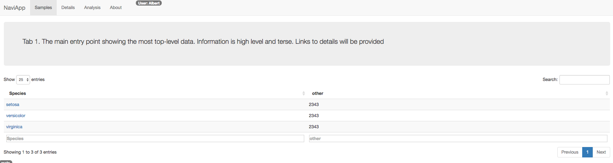
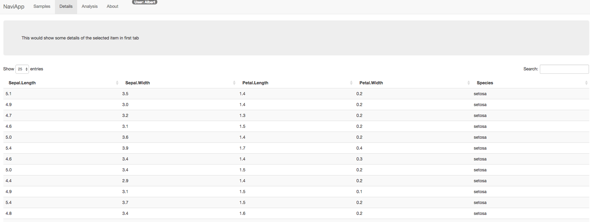

# Template for Navigation R Shiny App

Shiny app for navigation within the app and heirachies. Link within same shiny app.


Main Page links to second tab page



Second Tab page




## Dependencies

```{r}
install.packages(c("htmltools","shiny","shinydashboard")
```
## Usage

Download files and run these as shiny Apps using runApp() in R shiny


```{r}
library(shiny)
runApp("navitemplatedir",port=1111,launch.browser = T)
```

The above runs the code saved in `navitemplatedir`

